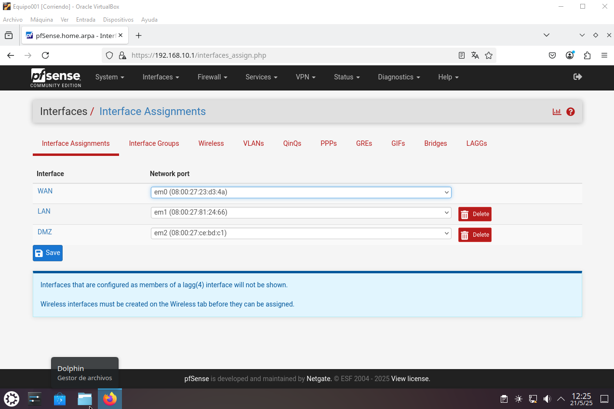

# Despliegue de Firewall PfSense
En está practica desplegaremos en un laboratorio virtual creado y configurado en VirtualBox, un firewall PfSense para gestionar una red LAN que simulará la red de equipos de trabajo de una empresa y una red DMZ donde se alojará un servidor web.

## Configuración del laboratorio virtual
Para esta practica se nos han entregado las máquinas virtuales en formato .ova las cuales importaremos a nuestro VirtualBox, a excepción del PfSense, que lo instalaremos y configuraremos nosotros mismos.

Antes de instalar nuestro PfSense configuraremos las redes NAT en VirtualBox, para ello iremos a Herramientas > Red y en el nuevo menú clickaremos en la pestaña Redes NAT y en Crear. Ahí configuraremos dos redes NAT sin protocolo DHCP (Se gestionarán desde el firewall).

Con las redes configuradas en VirtualBox vamos a añadirselas a nuestro PfSense desde el apartado Red de la configuracion de la máquina virtual. El adaptador 1 actuará como WAN y lo configuraremos como "Adaptador puente".

El adaptador 2 lo configuraremos como "Red NAT" y le asignaremos la red que configuramos en el paso anterior como LAN.

El adaptador 3 lo configuramos también como "Red NAT" y le asignamos la red que configuramos como DMZ.

## Instalación PfSense
Iniciamos la instalación aceptando los derechos de copyright.

Seleccionamos Install PfSenese

Seleccionamos Auto (ZFS)
* ZFS (acrónimo de Zettabyte File System) es un sistema de archivos y administrador de volúmenes desarrollado originalmente para el SO Solaris y ahora mantenido por OpenZFS. Se caracteriza por su robustez, escalabilidad, gestión simplificada, y funciones avanzadas como instantáneas, clonación, compresión, desduplicación y reparación automática de datos.

Seleccionamos Install

Seleccionamos Stripe

Marcamos la unica opción que tenemos

Seleccionamos YES puesto que no tenemos datos almacenados y no se perderá nada.

Dejamos que se instale

Para finalizar la instalación nos pide que reiniciempos, pero al estar en una maquina virtual lo que vamos a hacer es apagarla, quitar la ISO de PfSense y volver a iniciar, esto es porque si dejamos la ISO montada se iniciará de nuevo la instalación.
Desde la configuración de PfSense en VirtualBox > Almacenamiento, eliminamos la ISO.

## Configuración PfSense
Desde el menú seleccionamos la opción 2 para configurar las direcciones Ip.
Empezaremos configurando la red LAN.

## Configuración desde Kubuntu
Ahora que ya está configurado desde el propio SO de PfSense vamos a configurarlo desde otra máquina virtual, para ello nos conectamos mediante la Ip LAN 192.168.10.1 desde el navegador. Se nos pediran unas credenciales que por defecto son:

Usuario> admin 

Contraseña> pfsense

Completamos la instalación basica indicando los DNS a usar en este caso 8.8.8.8 y 4.4.4.4 y pasamos a la configuración de las redes, desde Interfacaes > Assigments clickamos en Add para añadir una tercera red que será la red DMZ

Aqui le cambiaremos el nombre para identificarla facilmente, la activamos y le asignamos la Ip correcta le daremos a guardar y a aplicar cambios.

Desde System > Advanced > Networking en las Opciones de DHCP seleccionamos KEA DHCP

Desde Services > DHCP Server configuraremos tanto la LAN como la DMZ, la LAN en principio viene configurada por defecto, si no hay que activar el "DHCP server on LAN Interface".

En el caso del DMZ a mayores de activar el DHCP server, hay que asignarle las Ip correspondientes.

