# Practica Power Apps
## Introducción
El objetivo de esta práctica es la creación de una aplicación mediante para el departamento de recursos humanos utilizando el entorno de desarrollo de Microsoft Power Apps.
## Entorno
Utilizaremos excel para crear varias tablas relacionadas con el departamento de recursos humanos.

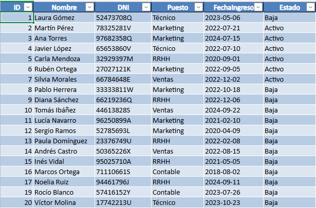

Desde Power Apps crearemos una App de lienzo.

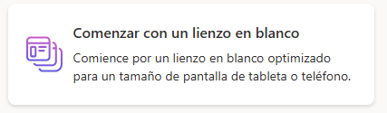

## Cargar la base de datos
Para introducir la base de datos creada en nuestro excel seleccionamos el icono de datos en el menú izquierdo, agregar datos, Excel Online.

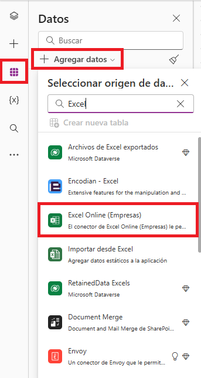

Desde ahi buscaremos en nuestro OneDrive donde tengamos guardado el excel que hemos hecho antes y seleccionamos las tablas.

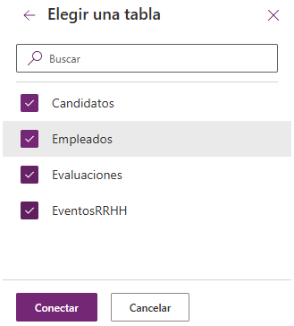

## Creación de la app
Desde la vista de arbol en el menú izquierdo seleccionamos Nueva pantalla.

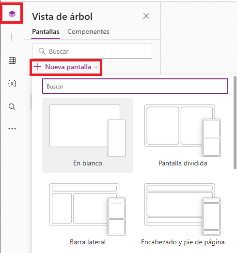

Con la pantalla creada le añadimos los datos de nuestra tabla utilizando una galería.

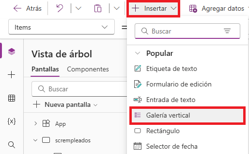

Seleccionando la galería vacía se abrirá un pequeño sub-menú desde el cual añadiremos la tabla exacta que queramos usar en esa galería.

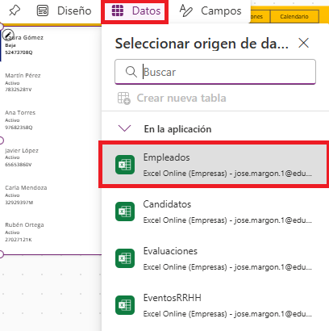

Para mostrar los campos que nos interesen, desde el mismo sub-menú seleccionamos "Campos".

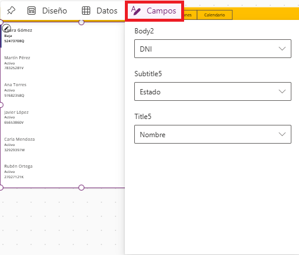

Desde las propiedades de la galería podemos modificar todos los aspectos relacionados con este.

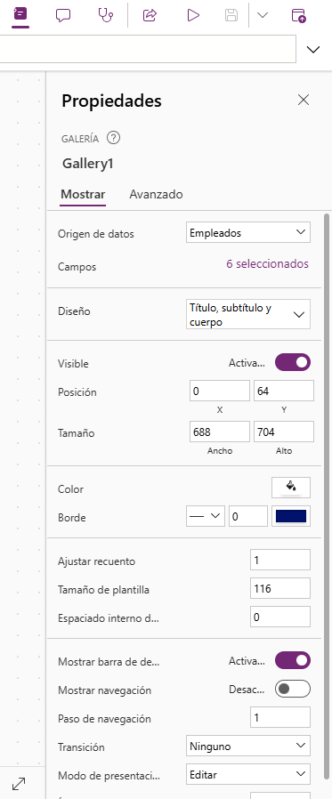

Y por ultimo desde las propiedades, si seleccionamos la pestaña "Avanzado" se nos permitirá modificar cosas mediante codigo.

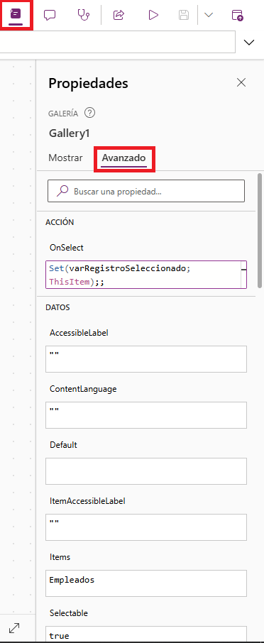

Así es como funciona Power Apps, en este caso explicado con una galería pero vendría a ser lo mismo para todo lo que añadamos a la aplicación.

## Aplicación
Mi aplicación son 4 pantallas conectadas entre si por un menú compartido en la parte superior.

### Empleados

Desde esta pantalla tenemos acceso a toda la lista de empleados, los cuales podemos seleccionar y ver o modificar sus datos asi como borrarlos, además pulsando el icono + el formulario se vaciará pudiendo añadir los datos para un nuevo empleado.

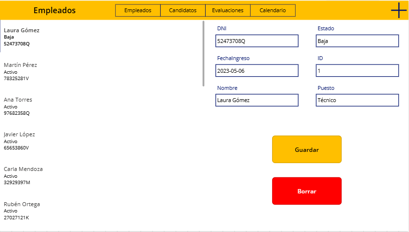

### Candidatos

La ventana candidatos funciona igual que la de empleados con la diferencia de que aqui se ven los datos de la gente a la que se entrevista.

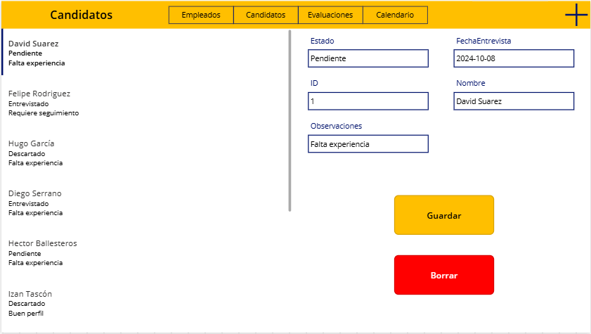

### Evaluaciones

La pantalla de evaluaciones permite añadir evaluaciones de desempeño y evaluaciones finales en caso de baja del empleado para tener referencias sobre ellos.

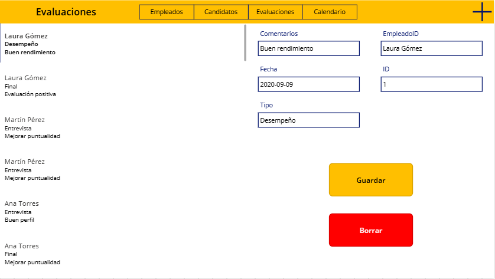

### Calendario

En la pantalla calendario podemos ver y añadir eventos, saliendo remarcado  el día en concreto que ocupa el evento.

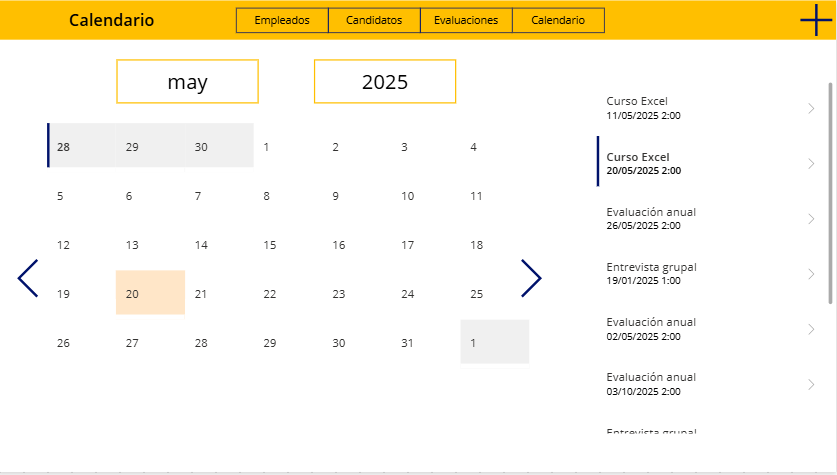

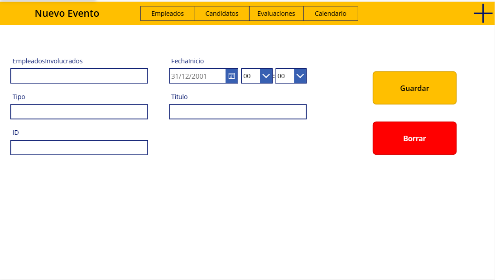