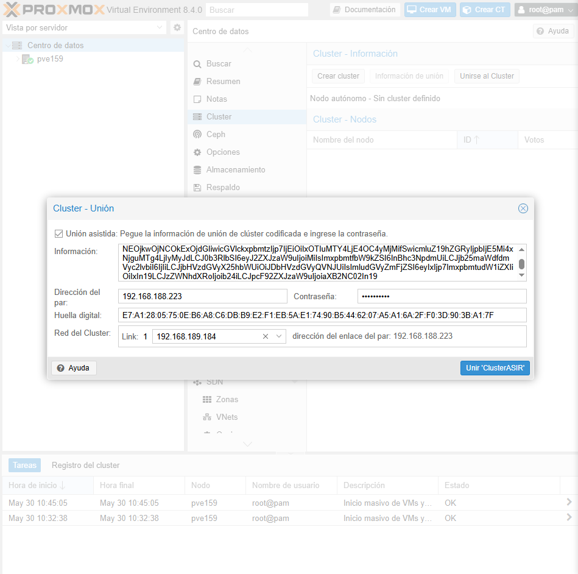

# Proxmox

En este proyecto vamos a instalar 2 hipervisores de tipo 1 Proxmox y los uniremos en cluster

## Preparación de hyper-v

Para instalar el SO de Proxmox utilizaremos Hyper-V y añadiremos una nueva maquina virtual a la que asignaremos 6Gb de RAM, desactivaremos los puntos de control, asignaremos un switch por defecto para tener salida a internet y activaremos la virtualización de hiper-v a través de powershell.


## Instalación de Proxmox

Al iniciar el instalador de Proxmox escogemos la primera opción para instalar la versión gráfica.


Aceptamos los terminos y condiciones.


Cambiamos al modo sistema de archivos xfs.


Seleccionamos país, idioma del teclado y zona horaria.


Establecemos una contraseña y un correo electronico.


En este paso debemos asegurarnos que cambiamos el hostname para que no se llamen pve los dos Proxmox, sino no podremos conectarlos al cluster.


Aqui vemos un resumen de lo que hemos ido seleccionando en la instalación y si está todo correcto pulsamos install.


Una vez finalizada la instalación apagamos la máquina, sacamos la iso y la volvemos a ejecutar.


Al volver a iniciarlo nos dará una ip que introduciremos en el navegador.


Para iniciar sesión usaremos como nombre de usuario "root" y como contraseña la que hayamos escrito durante la instalación.


## Creación del cluster

Para crear el cluster iremos a la sección cluster y seleccionamos crear cluster, al crearlo nos saldrá un apartado llamado información de unión, deberemos copiar el párrafo.


Para conectar los dos Proxmox que hemos creado iremos ahora al segundo, donde seleccionaremos Unirse al cluster, en la ventana que se nos abrirá copiamos la información de unión, lo cual nos desbloqueará nuevos campos que rellenar, deberemos escribir nuestra contraseña y seleccionar la ip de la red del cluster.



Una vez los tengamos conectados tendremso una pantalla como esta


## Ubuntu server

Instalaremos un ubuntu server minimal con 512 MB de RAM en hyper-v que actuará como servidor NFS para el cluster.

Para instalar el servidor NFS ejecutamos el siguiente comando.

```
sudo apt install nfs-kernel-server
```

Para sincronizarlo con Proxmox debemos seleccionar desde este Almacenamiento > Agregar > NFS y al rellenar los datos pulsamos agregar


## Contenedor

Para crear un contenedor vamos a necesitar la plantilla correspondiente a instalar. Para ello desde el almacenamiento que nos interese seleccionamos Plantillas de CT > Plantillas En este caso vamos a utilizar Debian


Para instalarlo seleccionamos en la esquina superior derecha Crear CT y se nos abrirá una ventana en la que iremos rellenando los datos que se nos pida para crear el contenedor.


Ahora iniciamos el contenedor y pulsamos iniciar para que arranque, para poder manejarlo seleccionamos  ">_ Consola".


## Instalar máquinas virtuales

Para instalar máquinas virtuales en proxmox descargaremos la iso que vayamos a utilizar, en este caso será alpine linux. Para cargarla en proxmox y poder utilizarla seleccionamos uno de los almacenamientos de los nodos > Imágenes ISO > Cargar


Con la ISO cargada en Proxmox, seleccionamos en la esquina superior derecha "Crear VM" y se nos abrirá una ventana similar a la que salió al crear los contenedores. Rellenamos los datos que se nos vayan pidiendo y pulsamos finalizar.


Ahora podremos iniciar la máquina y desde el a partado consola podremos comprobar que está funcionando.


Realizamos los mismos pasos en el otro nodo pero con un SO diferente, en este caso tiny core linux.


## Migración

Existen dos tipos de migración, migración en caliente y en frio. La migración en caliente es pasar de un nodo a otro un SO estando este en funcionamiento mientras que enfrio el SO estará apagado, en ambos será necesario que la iso esté almacenada en el servidor NFS que he añadido previamente.
Para hacer una migración tan solo debemos seleccionar el SO que nos interese y pulsar el botón de la esquina superior derecha que pone "Migrar".


